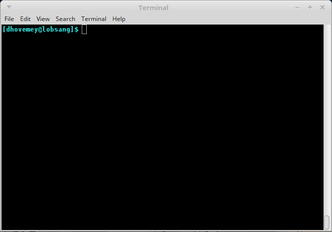

**Milestone 1**: Due <strike>Friday, April 10th</strike> Monday, April 13th by 11:59 PM

**Milestone 2**: Due <strike>Friday, April 17th</strike> Monday, April 20th by 11:59 PM

# Getting Started

Start by downloading [CS101\_Assign05.zip](CS101_Assign05.zip), saving it in the CS101 directory within your home directory.

Start a Cygwin Bash Shell (or Linux terminal, or MacOS terminal) and run the following commands:

    cd h:
    cd CS101
    unzip CS101_Assign05.zip
    cd CS101_Assign05

(Note that you should omit the cd h: step on Linux and MacOS.)

Using a text editor (e.g., Notepad++), open the file 

    CS101/CS101_Assign05/GameOfLife.cpp

You will add your code to this file.

# Your Task

In this assignment, you will implement a simulation of [Conway's Game of Life](http://en.wikipedia.org/wiki/Conway%27s_game_of_life), also known as simply *Life*.  Life is a simulation of simple one-celled organisms on a two-dimensional grid.

The simulation starts with an initial generation of cells, and then proceeds by repeatedly computing the next generation based on the current generation.

As each new generation is computed, cells either live or die according to the Rules of Life:

* if a cell is alive in the current generation, but has fewer than 2 neighbors, it dies of isolation
* if a cell is alive in the current generation, but has more than 3 neighbors, it dies of overcrowding
* if a cell is dead in the current generation, and has exactly 3 neighbors, it is born

The neighbors of a cell are the 8 cells immediately surrounding it.

## Data Representation

The current generation of cells is stored in the `board` array, defined in the `main` function:


int board[HEIGHT][WIDTH];


The `HEIGHT` and `WIDTH` constants are defined near the top of the file, and define the number of rows and columns of cells (20 and 60, respectively).

Each array element represents one cell.  Alive cells are represented as 1 values, and dead cells are represented as 0 values.

## Functions

Your program should implement and use the following functions:


void init_random_board(int board[HEIGHT][WIDTH]);
void print_board(int board[HEIGHT][WIDTH]);
int get_cell(int board[HEIGHT][WIDTH], int row, int col);
int count_neighbors(int board[HEIGHT][WIDTH], int row, int col);
void compute_next_gen(int board[HEIGHT][WIDTH]);


Prototypes are provided.

The `init_random_board` function should assign a random 0 or 1 value to each element of the array passed as a parameter, such that the probability of setting a cell to 0 is .75, and the probability of setting a cell to 1 is .25.  (In other words, about 75% of the cells should be 0, and about 25% of the cells should be 1.)

The `print_board` function should print a textual representation of the cells contained in the array passed as a parameter.  Each alive cell should be represented by an asterisk (\*), and each dead cell should be represented by a period (.).

The `get_cell` function should return the value of the cell whose row and column are specified.  As a special case, if either the specified row or column is out of bounds, the function should return 0.

The `count_neighbors` function should return a count of the total number of alive neighbors of the cell whose row and column are given.  There is one important special case: cells at the edges of the array will have fewer than 8 neighbors.  Nonexistent neighbors should be considered to have a value of 0.  **Hint**: Call the `get_cell` function, since it automatically returns 0 when called with the row and column of a nonexistent cell.

The `compute_next_gen` function should update the array passed as the parameter so that it contains the next generation of cell values according to the rules.  **Hint**: Use a second array to store the computed values for the next generation, and then copy them into the parameter array.  This approach is similar to the one recommended in [Lab 16](../labs/lab16.html).

## Running the program

When the program starts, it will prompt the user to either load initial game data from a file, or generate a random initial game state (by calling your `init_random_board` function.)  It will also prompt the user for a number of generations to simulate.

## Milestone 1

For the first milestone, modify the program so that it prints the initial game state using the `print_board` function.  (The program will not use the input number of generations for this milestone.)  Note that you will need to implement the `init_random_board` function, since it is called from the initialization code.  You will need to add the code to print the initial game state.

Example runs:

<pre>
(0) Load from file, or (1) initialize random board? <b>0</b>
Name of file to load: <b>glider.dat</b>
How many generations? <b>10</b>
Initial board:
............................................................
...*........................................................
.*.*........................................................
..**........................................................
............................................................
............................................................
............................................................
............................................................
............................................................
............................................................
............................................................
............................................................
............................................................
............................................................
............................................................
............................................................
............................................................
............................................................
............................................................
............................................................
</pre>

<pre>
(0) Load from file, or (1) initialize random board? <b>1</b>
How many generations? <b>10</b>
Initial board:
**.*.................*..*...*..*..*....*.*..**........*.....
...**......**..*.....*........**..*....*..*......*..*.......
*...*...**........**.............*.........*...........*....
...*......*.*.....*.***.....*.*.....*...*..*.*.*.......*.*.*
........*..***.........****.*.........*.*.***...*.*.........
*....**..*........*...*.*...*..*...............*............
.....**...***.......**...........*.**........***............
**...*....*.*.......*....*...**......*....*...**....*......*
....***..*......*.......*...................*...*........*.*
...*...**....**..*........**..*..*...*....*..*..*.*...*..*.*
*....***.*.*...*.*........*......*.*.........*..*...*.......
.....*.......**.*..***.***....*........*.....*...*..*..*.*.*
...*......*...**......*.*...........*.*..****.*.....*..***..
..**...*...*.**..*.*........*...*.......*.....**..*.*.*.....
*.**....*..*....*.....*.**......*.....*.......*.............
.*...***...*..*..*......*.*.*......**....*......**..........
..*.....*..*....*..*....*.*.....*...*..*..*.*.***.........*.
....*..*.**.....*....*..***..*.*.**....*..*...**.*.***.**...
.*.....**.*..**..........*......*......*......*.*..........*
*..***.....**.......***...*.*..*................***..***....
</pre>

Note that you will probably see a different random initial state.

## Milestone 2

For the second milestone, modify the program so that it simulates the specified number of generations and prints the final game state using the `print_board` function.

Example run:

<pre>
(0) Load from file, or (1) initialize random board? <b>0</b>
Name of file to load: <b>glider.dat</b>
How many generations? <b>33</b>
Initial board:
............................................................
...*........................................................
.*.*........................................................
..**........................................................
............................................................
............................................................
............................................................
............................................................
............................................................
............................................................
............................................................
............................................................
............................................................
............................................................
............................................................
............................................................
............................................................
............................................................
............................................................
............................................................
Final board:
............................................................
............................................................
............................................................
............................................................
............................................................
............................................................
............................................................
............................................................
............................................................
..........*.................................................
...........**...............................................
..........**................................................
............................................................
............................................................
............................................................
............................................................
............................................................
............................................................
............................................................
............................................................
</pre>

## Insane extra credit

In milestone 2, for up to 30 points of extra credit, allow the user to request an animation showing each intermediate state of the simulation.  Use the terminal graphics functions described in [Lab 17](../labs/lab17.html).  You can use the `cons_sleep_ms` function to pause the program for a given number of milliseconds &mdash; each frame of the animation should be visible for a short period of time, perhaps 250 milliseconds.

Example run, showing the `glider.dat` input file:

> 

Example run, showing random input:

> 

In the animations above, colors are used to indicate the number of generations for which cells have been alive: white cells are new, bright yellow cells have been alive for 2 generations, bright green cells have been alive for 3 generations, etc.

<b>Important</b>: The standard features of milestone 2 must still work as described.  Don't implement the extra credit until the standard features are working.

# Grading

For milestone 1 (full credit is 50 points):

* `init_random_board` function: 15
* `print_board` function: 15
* the program uses the functions correctly on the `board` array: 15
* good coding style: 5

For milestone 2 (full credit is 100 points):

* `get_cell` function: 10
* `count_neighbors` function: 10
* `compute_next_gen` function: 35
* simulates requested number of generations: 15
* output final generation: 20
* good coding style: 10

Note that for both milestones, we expect you to use good coding style, including correct indentation, choosing meaningful variable names, and adding appropriate comments.

# Submitting

To submit your work, make sure your **GameOfLife.cpp** file is saved, and in the Cygwin window type one of the following commands (depending on whether you are submitting **Milestone 1** or **Milestone 2**).

For **Milestone 1**:

    make submit_ms1

File **Milestone 2**:

    make submit_ms2

Enter your Marmoset username and password (which you should have received by email.) Note that your password will not be echoed to the screen. Make sure that after you enter your username and password, you see a message indicating that the submission was successful.

If the **make** commands above do not work, you can [submit using the web interface](../submitting.html) (see the link for details).

**Important**: Make sure that you check the file(s) you submitted to ensure that they are correct. Log into the server using the following URL (also linked off the course homepage):

> <https://cs.ycp.edu/marmoset/>

You should see a list of labs and assignments. In the row for **assign05\_ms1** (milestone 1) or **assign05\_ms2** (milestone 2), click the link labeled **view**. You will see a list of your submissions. Download the most recent one (which should be listed first). Verify that it contains the correct files.

**You are responsible for making sure that your submission contains the correct file(s).**

<!-- vim:set wrap: ­-->
<!-- vim:set linebreak: -->
<!-- vim:set nolist: -->

