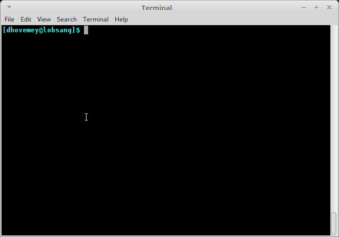
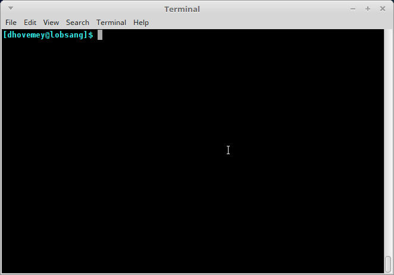

**Due**: Tuesday, May 5th by 11:59 PM

# Getting Started

Start by downloading [CS101\_Assign06.zip](CS101_Assign06.zip), saving it in the CS101 directory within your home directory.

Start a Cygwin Bash Shell (or Linux terminal, or MacOS terminal) and run the following commands:

    cd h:
    cd CS101
    unzip CS101_Assign06.zip
    cd CS101_Assign06

(Note that you should omit the cd h: step on Linux and MacOS.)

Using a text editor (e.g., Notepad++), open the file 

    CS101/CS101_Assign06/Snake.cpp

You will add your code to this file.

# Your Task

Your task is to implement a [Snake](http://en.wikipedia.org/wiki/Snake_%28video_game%29) game.

The play controls a snake.  The snake consists of some number of segments.  At each time step, the snake's head segment moves up, right, down, or left, and the other segments of the snake follow.  The player can control the direction of the snake's head using the arrow keys.  At all times, there is a piece of fruit on the playing field.  If the snake eats the fruit (i.e., the snake's head segment reaches the fruit), the snake grows by one segment.  When the fruit is eaten, a new piece of fruit appears in a random location.  If the snake's head goes out of bounds, or if the snake's head collides with one of the snake's body segments, the game is over.

Here is an animation showing gameplay:

> 

Here is an animation showing the player losing because the snake's head went out of bounds:

> 

Here is an animation showing the player losing because the snake's head collided with its body:

> 

You will use the terminal graphics functions: see [Lab 17](../labs/lab17.html), [Lab 18](../labs/lab18.html), [Lab 20](../labs/lab20.html), and especially [Lab 22](../labs/lab22.html) and [Lab 23](../labs/lab23.html).

# Approach

This is a substantial assignment.  Here is a suggested approach to getting all of the features of the program working:

1. Define `struct Point` and `struct Snake` data types.
2. Add fields to `struct Scene` to represent the snake.
3. Add code to `scene_init` to initialize the snake.
4. Add code to `scene_render` to draw the segments of the snake.  The snake should be visible, but will not move.
5. Add code to `scene_update` to move the snake by adding a new head segment and removing the current tail segment. The snake will now move in one direction.
6. Add code to `scene_update` to check for keypresses, changing the direction of the snake as appropriate when an arrow key is pressed.  Now you should be able to control the snake.
7. Add code to `scene_update` to detect if the snake's head has moved out of bounds, and if so, set a "game over" flag in the `struct Scene`.  Also, add code to `scene_render` to print a game over message when the game over flag is set.
8. Add code to `scene_update` to detect if the snake's head has collided with any of its body segments, and if so, set a game over flag in `struct Scene`.
9. Add code to check whether the snake's head is in the same place as the piece of fruit, and if so, increase the player's score, increase the snake's number of segments by 1, and place a new piece of fruit in a random location.  (Make sure that the new fruit location isn't in the same place as any of the snake's segments.)

# Hints, specifications, and requirements

## Playing field, rendering

The playing field should be 80 characters wide by 23 characters high.  (This leaves one row in the terminal available for displaying the current score and number of segments.)

The `scene_render` function should use the terminal graphics functions to render a visual representation of the game state, including:

* The segments of the snake
* The piece of fruit
* The current score
* The current number of segments

The score and number of segments should be rendered in the last row of the terminal.

## `struct Scene`, `main` function

The starting code has a `struct Scene` data type and an example `main` function.  You should add fields to `struct Scene` to represent the current game state.  **Important**: you may *not* modify the `main` function.  This means that you must define `scene_init`, `scene_render`, and `scene_update` functions that can work with the code in the `main` function.

## Defining struct types and functions

You should define struct data types and accessor functions as necessary to implement the game functionality.  For example, in my solution, I defined `struct Point` and `struct Snake` data types.  I also defined the following functions:


void point_init(struct Point *p, int x, int y);
void snake_init(struct Snake *snake);
void snake_append_segment(struct Snake *snake, int x, int y);
void snake_remove_tail(struct Snake *snake);
struct Point snake_get_head(const struct Snake *snake);
struct Point snake_get_segment(const struct Snake *snake, int index);


You are welcome to define your own versions of these functions if you would like to.

## Implementing the snake

A good way to represent the snake is using an array of segments, such that each segment is an x/y coordinate pair (e.g., a `struct Point`).  Because the number of segments varies (increasing each time the snake eats a piece of fruit), the snake struct type should use a counter field to keep track of how many segments there are.  The snake struct type should also keep track of which direction the snake is moving in.  Here is how I defined my `struct Snake` data type:


struct Snake {
    struct Point segments[MAX_SEGMENTS];
    int num_segments;  // how many segments the snake has
    int dir;           // which direction the snake is moving in
};


When the game starts, the snake should have 8 segments.

The game should allow the snake to have up to 100 segments, so the `MAX_SEGMENTS` constant should be defined as 100.

Moving the snake is conceptually quite simple: a new head segment is added, based on the location of the current head segment and the snake's direction of motion.  If the length of the snake isn't changing (meaning that the snake did not eat a piece of fruit, or the snake is already at the maximum length), then the "tail" segment should be removed.  Adding a new head segment is easy: just set the x and y coordinates of the new head segment in the appropriate element of the array of segments, and increment the total number of segments by 1.  Removing the tail segment is a bit more complicated: the easiest way is to move each segment other than the tail segment back by one position in the array of segments, and then decrement the number of segments.

The `scene_update` function should move the snake each time it is called.  It should also check to see if the snake's head has gone out of bounds or has collided with the snake's body, and should check to see if the piece of fruit was eaten.

Growing the snake (when a piece of fruit is eaten) is easy: just add a new head segment without removing the current tail segment.

## Handling user input

In the `scene_update` function, call the `cons_get_keypress()` function.  If it returns one of the arrow keys (`UP_ARROW`, `RIGHT_ARROW`, `DOWN_ARROW`, or `LEFT_ARROW`), then change the direction of the snake as appropriate.  Note that you should not allow the snake to reverse its direction: for example, if the snake's head is currently moving up, then `scene_update` should do nothing if `DOWN_ARROW` is pressed.

If the `q` key is pressed, then `scene_update` should return 0, causing the `main` function to finish (and the program to exit.)   Otherwise, `scene_update` should return 1 (causing `main` to keep running.)

Note that the `cons_get_keypress()` function will return -1 if no key has been pressed.

## Scoring

Each time the snake eats a piece of fruit, the player earns a number of points equal to 10 times the snake's current number of segments.

# Grading

Full credit for the assignment is 125 points.

Your grade will be determined according to the following criteria:

* `struct Scene` has representation of snake: 10
* snake is displayed: 10
* snake moves: 15
* player can control snake: 15
* game ends when snake goes out of bounds: 10
* game ends when snake's head collides with its body: 10
* `struct Scene` has representation of fruit: 5
* fruit is placed randomly and doesn't overlap snake: 5
* snake can eat the fruit: 5
* snake grows by one segment when fruit is eaten: 10
* score increases when fruit is eaten: 5
* score is displayed: 5
* number of segments is displayed: 5
* pressing `q` ends the program: 5
* good coding style: 10

## Insane extra credit

For up to 30 points of extra credit, implement one or more of the following enhancements:

* Playing field has obstacles: if the snake hits an obstacle, the game is over
* The player has multiple lives, and additional lives can be earned based on the player's score
* The game speeds up slightly each time the snake eats a piece of fruit
* There is an enemy snake controlled by the computer (hard)

**Important**: Include a comment at the top of your program explaining which extra credit features you implemented.

# Submitting

To submit your work, make sure your `Snake.cpp` file is saved, and in the Cygwin window type the command

    make submit

Enter your Marmoset username and password (which you should have received by email.) Note that your password will not be echoed to the screen. Make sure that after you enter your username and password, you see a message indicating that the submission was successful.

**Important**: Make sure that you check the file(s) you submitted to ensure that they are correct. Log into the server using the following URL (also linked from the course homepage):

> [https://cs.ycp.edu/marmoset](https://cs.ycp.edu/marmoset)

You should see a list of labs and assignments. In the row for **assign06**, click the link labeled **view**. You will see a list of your submissions. Download the most recent one (which should be listed first). Verify that it contains the correct files.

**You are responsible for making sure that your submission contains the correct file(s).**

<!-- vim:set wrap: ­-->
<!-- vim:set linebreak: -->
<!-- vim:set nolist: -->
