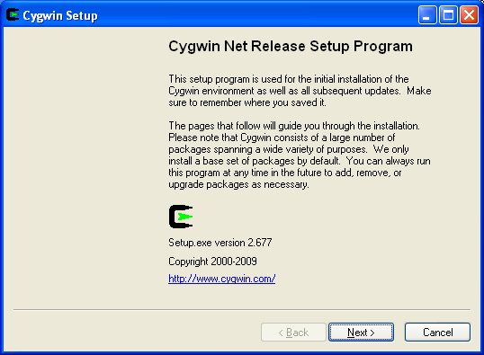
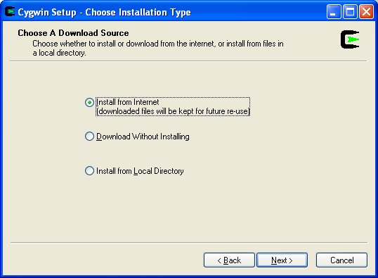
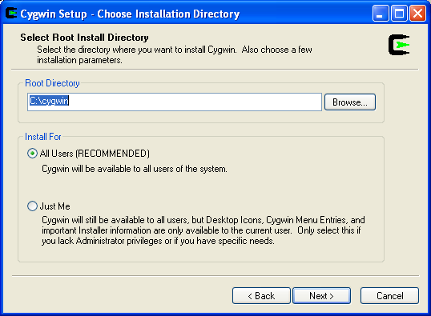
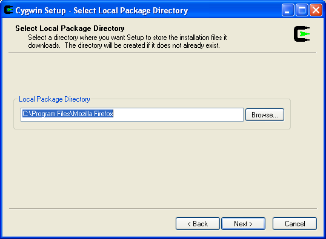
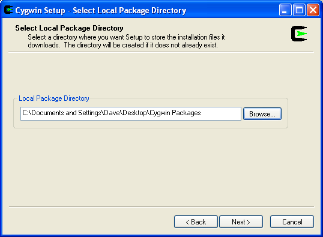
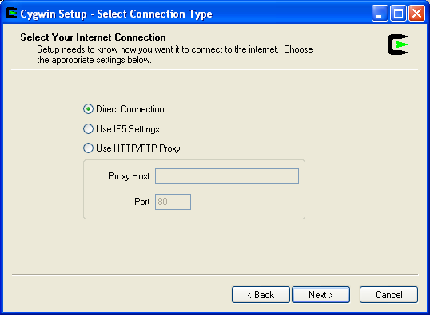
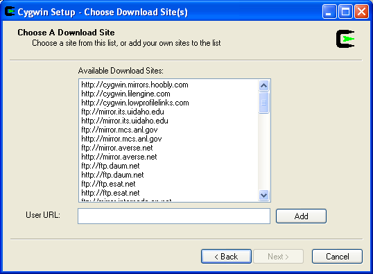
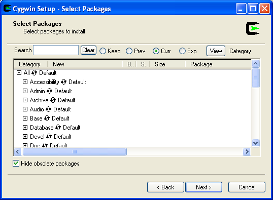
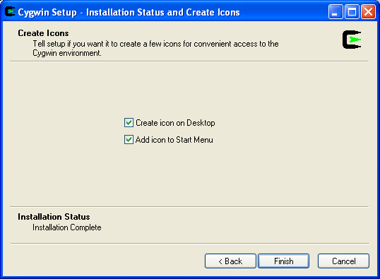

This page describes how to install the [cygwin](http://cygwin.com/) tools you will need to compile, run, and submit programs in CS 101 on a Windows system.

In order to use the Cygwin tools to compile and run programs, you may need to configure your antivirus software to avoid scanning the directories containing your programs.  For example, the free version of Avast may delete the executable (<code>.exe</code>) files created by the <code>make</code> command, making it impossible to run your program.

**Step 1**: Go to <http://cygwin.com/>. Click the **Install Cygwin** tab in the left hand column and click the **setup.exe** to download the setup program. Run the setup program which you just downloaded.

You should see the following window:

> 

Click **Next**.

**Step 2**: You will see the "Choose Installation Type" window:

> 

Choose "Install from Internet" and click **Next**.

**Step 3**: You will see the "Choose Installation Directory" window:

> 

Keep the defaults (install to **C:\\cygwin**, install for All Users.) Click **Next**.

**Step 4**: Next is the "Select Local Package Directory" window:

> 

Rather than accepting the default, create a directory within your Desktop directory, click **Browse**, and choose that directory as your local package directory. For example, I used:

> 

Click **Next**.

**Step 5**: Next is the "Select Connection Type" window:

> 

Choose "Direct Connection". Click **Next**.

**Step 6**: You should now see the "Choose Download Site(s)" window:

> 

You can choose any download site. An HTTP site might work better than an FTP site. Click **Next**.

**Step 7**: You will now see the "Select Packages" window:

> 

You will need to install the following packages:

> Category | Packages
> -------- | --------
> Archive  | zip, unzip
> Devel    | gcc-g++, make
> Interpreters | perl
> Libs | libncurses-devel
> Net | curl, openssh

To choose a package, expand its category, then click on the word "Skip" to the left of the package name. The word "Skip" will be replaced by a version number. For example, after choosing the "curl" package in the "Net" category, my window looked like this:

> 

You may install additional packages if you would like to.

When you have selected the required packages, click **Next**. You will see a progress dialog. It may take a while for all of the packages to be downloaded and installed.

**Step 8**: You're done! You should see a window that looks like the following:

> 

Make sure that you add at least one icon (to the Desktop or Start Menu).

You can now start the Cygwin bash shell by clicking on the **Cygwin** icon on the Desktop or the **Start &rarr; All Programs &rarr; Cygwin &rarr; Cywgin Bash Shell** menu item.
