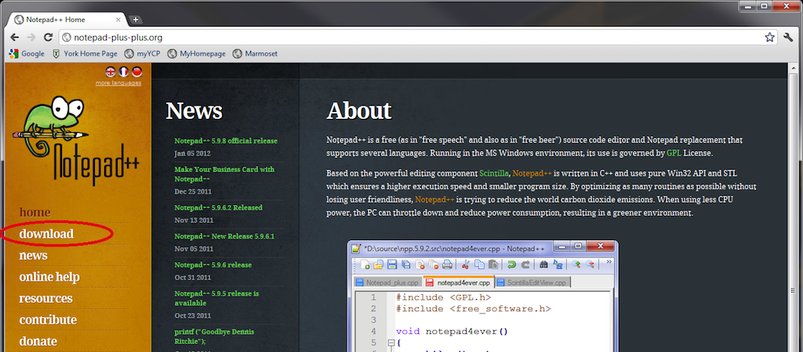
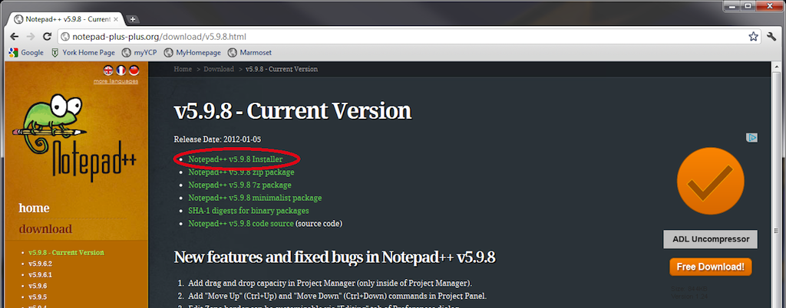

This page describes how to install the [Notepad++](http://notepad-plus-plus.org) text editor. This is the editor we are using in class to edit C/C++ programs.

These notes assume you are installing on a Windows system.

**Step 1**. Go to the [Notepad++](http://notepad-plus-plus.org) web site. Click on the **Download** link in the sidebar:

> 

**Step 2**. Click the **Download the current version** item. Click the link labeled **Notepad++ v5.9.8 Installer** and save the install file somewhere (e.g. Desktop):

> 

**Step 3**. In Windows, double-click to run the installer executable (**npp.5.9.8.Installer.exe**) and accept the default installation options.

When the installer completes, Notepad++ will be available as the **Start-\>All Programs-\>Notepad++-\>Notepad++** menu item.
