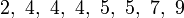
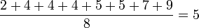
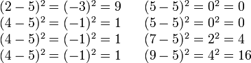
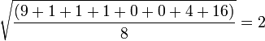

Getting Started
===============

As always, you may refer to [Lab 1](lab01.html) if you need a reminder about how to start the **Cygwin Terminal** or **Notepad++**.

Begin by downloading [CS101\_Lab14.zip](CS101_Lab14.zip). Save the zip file in the **H:\\CS101** directory.

Start the **Cygwin Terminal** and run the following commands:

    cd h:
    cd CS101
    unzip CS101_Lab14.zip
    cd CS101_Lab14

Start the **Notepad++** text editor. Use it to open the files

> **H:\\CS101\\CS101\_Lab14\\Stats.cpp**

Your Task
=========

Write a program that computes some simple statistics from user specified input. Your program should prompt the user to enter four integer values, and then compute the following statistical values based on the user input: the **mean**, the **standard deviation**, the **maximum** value, and the **minimum** value.

You must write the following four functions to perform the computation for these statistical values:

-   **mean** - Computes the mean of four input values  
    *Input:* Accepts four integer arguments

    *Returns* the **mean** of the four integer input values as a **double**

-   **stddev** - Computes the standard deviation of four input values (see below for an example of how to compute the standard deviation)  
    *Input:* Accepts four integer arguments

    *Returns* the **standard deviation** of the four integer input values as a **double**

-   **max** - Determines the maximum of four input values  
    *Input:* Accepts four integer arguments

    *Returns* the **maximum** of the four integer input values as an **integer**

-   **min** - Determines the minimum of four input values  
    *Input:* Accepts four integer arguments

    *Returns* the **minimum** of the four integer input values as an **integer**

In all, your final program should have a total of five functions (the four above, plus your **main** function)

Example run (user input in **bold**):

<pre>
Enter four integer values: <b>66 12 33 99</b>

The mean of your values is 52.50
The standard deviation of your values is 33.03
The max of your values is 99
The min of your values is 12
</pre>

When you are ready to compile the program, in the Cygwin window type the command:

    make

To run the program, in the Cygwin window type the command

    ./Stats.exe

**Computing standard deviation**

From [Wikipedia (standard deviation)](http://en.wikipedia.org/wiki/Standard_deviation):

To compute the standard deviation of a set of numbers, such as those below:

> 

first, find the **mean** of those numbers

> 

then, compute the difference of each data point from the mean, and square the result of each (see hints below):

> 

Finally, compute the average of these values, and the take square root to get the standard deviation:

> 

In this example, the standard deviation is **2**.

Hints
=====

You may find it useful to use the **pow(double x, double y)** function in the **math.h** library: it computes <i>xy</i> (*x* raised to the power *y*).  You can read more about the **pow** function [here](http://pubs.opengroup.org/onlinepubs/9699919799/functions/pow.html).

Submitting
==========

When you are done, run the following command from the Cygwin bash shell:

    make submit

You will be prompted for your Marmoset username and password, which you should have received by email. Note that your password will not appear on the screen.

**Important**:

> You **must** submit your work before leaving class. If you do not submit work, you will not receive any credit for the lab.
