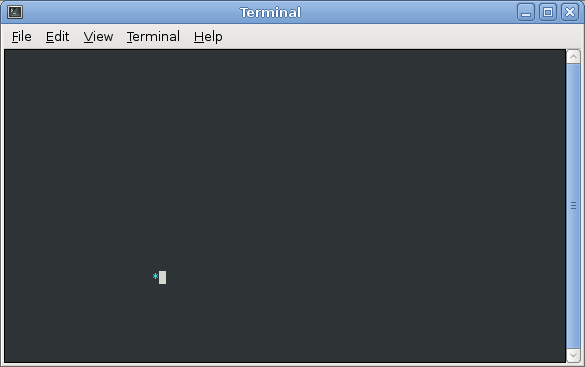

Getting Started
===============

Refer to [Lab 1](lab1.html) if you need a reminder about how to start **Cygwin Terminal** or **Notepad++**.

Start by downloading [CS101\_Lab18.zip](CS101_Lab18.zip), saving it in the directory **H:\\CS101**.

Start a **Cygwin Terminal** and run the following commands:

    cd h:
    cd CS101
    unzip CS101_Lab18.zip
    cd CS101_Lab18

Using **Notepad++**, open the file

> **H:\\CS101\\CS101\_Lab18\\Boing.cpp**

Run the command

    make

when you are ready to compile the program. To run the program, run the command

    ./Boing.exe

The program will exit when you press a key.

Your Task
=========

Your task is to animate a text character so that it bounces around the terminal window.

When you run the program, it should look something like this (note that the animation repeats every 60 seconds):

> 

The animation works by updating the contents of the window 10 times per second. Each time the window is redrawn, the character should be in a slightly different position, giving the illusion of motion.

The **main** function of the program looks like this:


int main(void) {
    int x, y, dx, dy;

    // initialize variables
    boing_init(&x, &y, &dx, &dy);

    int keep_going = 1;
    while (keep_going == 1) {
        // print the character using x and y as its location
        boing_render(x, y);

        // update the terminal window
        cons_update();

        // update the variables so that the character will appear to move
        // the next time the boing_render function is called
        boing_update(&x, &y, &dx, &dy);

        // See if a key has been pressed
        int key = cons_get_keypress();
        if (key >= 0) {
            keep_going = 0;
        }

        // Pause for a short time
        cons_sleep_ms(1000/10);
    }

    return 0;
}


You will not need to modify the **main** function. Instead, you will implement the **boing\_init**, **boing\_render**, and **boing\_update** functions.

The goal of these functions is to initialize, use, and update the variables **x**, **y**, **dx**, and **dy**:

-   **x** and **y** represent the position (column and row) of the character
-   **dx** and **dy** represent the horizontal and vertical direction in which the character is moving. The values of these variables should always be -1 or 1. Each time **boing\_update** is called, **x** should be modified by adding **dx** to it, and **dy** should be modified by adding **dy** to it. For example, if **dx** is 1, then following a call to **boing\_update**, the value of **x** should increase by 1.

The **boing\_init** and **boing\_update** functions take *pointers* to the variables, so that their values can be modified.

Here is what each function should do:

<b>void boing\_init(int \*px, int \*py, int \*pdx, int \*pdy)</b>

> Set the **x**, **y**, **dx**, and **dy** variables to initial values. Note that the parameters to the function are *pointers* to the variables, so the function will need to dereference the pointers in order to access the variables. For example, **\*pdx** is a way of referring to **dx**.
>
> **x** and **y** should be set to an initial column and row somewhere in the window (which by default will have 80 columns and 24 rows).
>
> **dx** and **dy** should each be set to either -1 or 1.

<b>void boing\_render(int x, int y)</b>

> Draws new contents for the window. This function should call **cons\_clear\_screen** to clear the screen, then call **cons\_move\_cursor** to move the cursor to row **y** and column **x**, then call **cons\_change\_color** to set the foreground/background colors, and last call **cons\_printw** to draw the character.
>
> Refer to [Lab 17](lab17.html) for documentation on how to use these functions.

<b>void boing_update(int \*px, int \*py, int \*pdx, int \*pdy)</b>

> Updates the **x**, **y**, **dx**, and **dy** variables. In general, **dx** is added to **x** and **dy** is added to **y**. However, if the character reaches one of the borders of the window, it should "bounce" by reversing one or both components of its direction. For example, if the character is moving from left to right (**dx** is 1), and **x** is already at the rightmost column, it should change direction so it is moving from right to left (**dx** is -1).
>
> As with **boing\_init**, the parameters are pointers.

Hints
=====

Do not modify the **main** function!

Start by adding definitions for the **boing\_init**, **boing\_render**, and **boing\_update** functions. You can leave the bodies of these functions empty initially.

Implement **boing\_init** and **boing\_render** first. When you get them working you should see the character in the window, but it won't move.

When you implement **boing\_render**, don't forget that the **cons\_move\_cursor** function takes the row as the first parameter and the column as the second parameter. So, your call to **cons\_move\_cursor** should be

    cons_move_cursor(y, x);

The **boing\_update** function will be the most challenging one. A good way to start is to unconditionally add **dx** to **x** and **dy** to **y**: the character will move, but will not bounce correctly when it reaches the edges of the window. You can start by getting the horizontal deflection from one edge to work: for example, if the character starts out moving from left to right, can you get it to change direction when it reaches the right edge of the window.

Note that the checks for horizontal and vertical deflection should be independent of each other: for a call to **boing\_update**, horizontal, vertical, or *both* horizontal and vertical deflection could occur (i.e., if the character reaches a corner).

Submitting
==========

To submit your work, type the command

    make submit

Enter your Marmoset username and password (which you should have received by email.) Note that your password will not be echoed to the screen.

**Important**:

> You **must** submit your work before leaving class. If you do not submit, you will not receive any credit for the lab.
