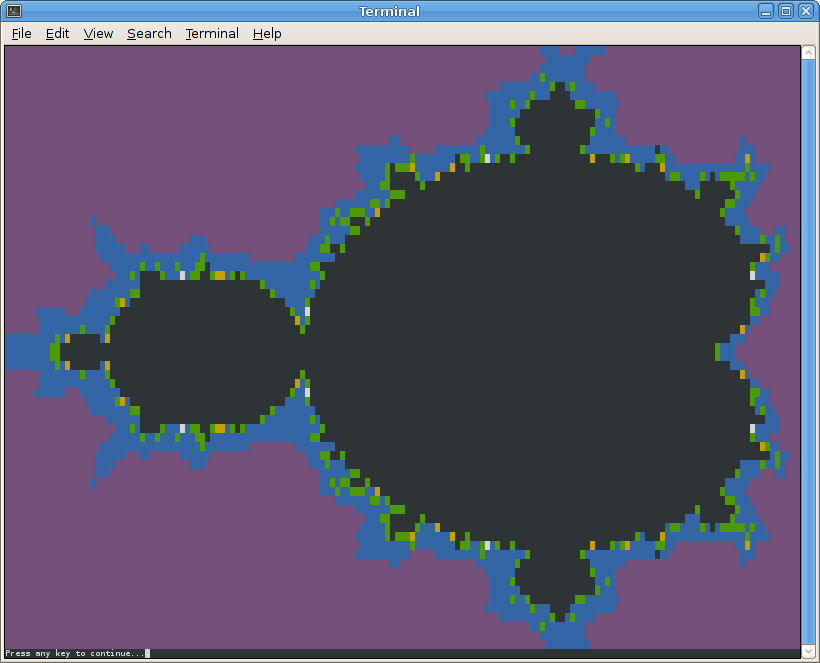

In this lab you will define a struct type to represent complex numbers, create accessor functions to add, multiply, and find the magnitude of complex numbers, and then implement an interesting computation using complex numbers.

Getting Started
===============

As always, you may refer to [Lab 1](lab01.html) if you need a reminder about how to start the **Cygwin Bash Shell** or **Notepad++**.

Begin by downloading [CS101\_Lab21.zip](CS101_Lab21.zip). Save the zip file in the **H:\\CS101** directory.

Start the **Cygwin Bash Shell** and run the following commands:

    cd h:
    cd CS101
    unzip CS101_Lab21.zip
    cd CS101_Lab21

Start the **Notepad++** text editor. Use it to open the files

> **H:\\CS101\\CS101\_Lab21\\Complex.cpp**

When you are ready to compile the program, in the Cygwin window type the command

    make

To run the program, in the Cygwin window type the command

    ./Complex.exe

Your Task
=========

There are three tasks.

First Task
----------

Define a struct data type called **Complex**. Instances of this type represent [complex numbers](http://en.wikipedia.org/wiki/Complex_number) consisting of a real component and an imaginary component.

You should add two fields of type **double** to the struct, one to represent the real part of the complex number, one to represent the imaginary part.

Second Task
-----------

At the top of **Complex.cpp** are six function prototypes declaring functions whose names begin with "complex\_". Implement these functions as follows:

**struct Complex complex\_create(double real, double imag)**  
Return a **struct Complex** instance that has the given real and imaginary values.

**struct Complex complex\_add(struct Complex c1, struct Complex c2)**  
Return the sum of the two complex numbers given as parameters. If **a** and **b** are the real and imaginary parts of **c1**, and **c** and **d** are the real and imaginary parts of **c2**, then the sum has **a**+**c** as its real part, and **b**+**d** as its imaginary part.

**struct Complex complex\_multiply(struct Complex c1, struct Complex c2)**  
Return the product of the two complex numbers given as parameters. If **a** and **b** are the real and imaginary parts of **c1**, and **c** and **d** are the real and imaginary parts of **c2**, then the product has **ac**-**bd** as its real part, and **bc**+**ad** as its imaginary part.

**double complex\_magnitude(struct Complex c)**  
Return the magnitude of the complex number given as the parameter. The magnitude is the square root of the sum of the squares of the real and imaginary parts.

**double complex\_get\_real(struct Complex c)**  
Returns the real part of the complex number given as the parameter.

**double complex\_get\_imaginary(struct Complex c)**  
Returns the imaginary part of the complex number given as the parameter.

Once you implement these functions, you can test your implementation by running the program:

<pre>
(1) Run tests, or (2) Mandelbrot set? <b>1</b>
complex_get_real (first test): passed
complex_get_real (second test): passed
complex_get_imaginary (first test): passed
complex_get_imaginary (second test): passed
complex_add (real part): passed
complex_add (imaginary part): passed
complex_multiply (real part): passed
complex_multiply (imaginary part): passed
complex_magnitude: passed
All tests passed!
</pre>

The last line of output should read **All tests passed!**

Third Task
----------

The [Mandelbrot Set](http://en.wikipedia.org/wiki/Mandelbrot_set) is a famous mathematical object. It is a set of complex numbers defined by an equation with complex numbers Z and C:

> Z = Z2 + C

The complex number C is in the Mandelbrot sert if and only if the equation can be iterated an infinite number of times without the magnitude of Z ever reaching 2. "Iterating" the equation works as follows:

-   The initial value of Z is real=0, imaginary=0
-   From the current value of Z, we can compute a new value of Z by squaring the old value and adding C

The third task is to complete the **mandelbrot\_num\_iters** function, whose prototype looks like this:

    int mandelbrot_num_iters(struct Complex c, int max_iters);

It takes a complex number, which represents C in the equation above. The function should return the number of times the equation (Z = Z2 + C) can be iterated before the magnitude of Z reaches 2. If the number of iterations reaches **max\_iters**, then **max\_iters** should be returned: this caps the maximum number of iterations (because for points within the Mandelbrot set, the equation can be iterated an infinite number of times.)

Once you implement this function, you can run the program and enter the value **2** when prompted. You should then see something similar to the following (click for full-size image):

> 

Note that you will get a more accurate picture if you make the font smaller and the terminal window larger.

What you are seeing is a graphical representation of part of the Mandelbrot set on the Complex plane. Each point is a complex number C, where the x coordinate is the real part, and the y coordinate is the imaginary part. Black locations are complex numbers that are in the set. The other colors represent how many iterations were required to show that a particular complex number was not in the set.

Submitting
----------

When you are done, run the following command from the Cygwin bash shell:

    make submit

You will be prompted for your Marmoset username and password, which you should have received by email. Note that your password will not appear on the screen.

**Important**:

> You **must** submit your work before leaving class. If you do not submit work, you will not receive any credit for the lab.
