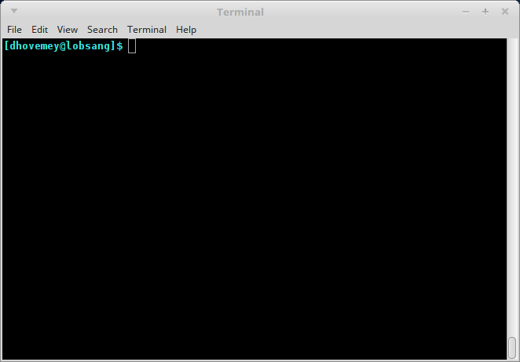

# Getting Started

As always, you may refer to [Lab 1](lab01.html) if you need a reminder about how to start the **Cygwin Bash Shell** or **Notepad++**.

Begin by downloading [CS101\_Lab23.zip](CS101_Lab23.zip). Save the zip file in the **H:\\CS101** directory.

Start the **Cygwin Bash Shell** and run the following commands:

    cd h:
    cd CS101
    unzip CS101_Lab23.zip
    cd CS101_Lab23

Start the **Notepad++** text editor. Use it to open the files

> **H:\\CS101\\CS101\_Lab23\\MiniGolf.cpp**

When you are ready to compile the program, in the Cygwin window type the command

    make

To run the program, in the Cygwin window type the command

    ./MiniGolf.exe

# Your task

Your task is to complete the program so that it simulates a game of mini golf.

Here is an animation showing what the completed game will look like:

> 

First, the player positions the ball using the up and down arrows.  Then, the player presses "j" or "k" to hit the ball.  ("j" hits up and to the right, and "k" hits down and to the right.)  The ball bounces around in much the same manner as labs [18](lab18.html), [20](lab20.html), and [22](lab22.html).  One additional detail is that there is a center obstacle that the ball can bounce off of.  If the ball reaches the cup, the player wins and the program displays "Hole in 1!!!".

You may or may not have enough time to complete the entire lab in class.  A good minimum goal would be to implement at least steps 1 through 3 described below.  In any case, make sure you submit what you have before you leave class.

# Implementation

## Data representation

The overall game state is represented by the `struct Scene` data type.  This data type uses `struct Point`, `struct Ball`, and `struct Rect` data types, as follows:


struct Point {
	int x, y;
};

struct Ball {
	struct Point pos;
	int dx, dy;
};

struct Rect {
	struct Point topleft;
	int width, height;
};

struct Scene {
	struct Rect obstacle;
	struct Rect cup;
	struct Ball ball;
	int mode; // game mode
};


You will not need to modify these struct types.

## Functions

The following functions operate on these data types:


void point_init(struct Point *p, int x, int y);
void ball_init(struct Ball *b, int x, int y, int dx, int dy);
void rect_init(struct Rect *r, int x, int y, int w, int h);
bool rect_contains_point(const struct Rect *r, const struct Point *p);
void scene_init(struct Scene *s);
void scene_render(const struct Scene *s);
void scene_update(struct Scene *s);


You will need to implement these functions.

## Step 1: Implement init functions

Start by implementing the `point_init`, `ball_init`, and `rect_init` functions.

## Step 2: Implement `scene_render`

Next, modify the `scene_render` function so that it draws the obstacle, cup, and ball.

Suggestion: the `fill` function is useful for drawing a solid rectangle (e.g., for the obstacle and cup).

At this point, you should be able to run the program and use the up and down arrow keys to move the ball up and down.

## Step 3: Move the ball in `scene_update`

Next, modify `scene_update` so that if the `mode` field of the `struct Scene` is set to `BALL_MOVING`, then move the ball.  For now, just have the ball move diagonally and bounce off the "bumpers", in much the same was as in labs 18, 20, and 22.

At this point, you should be able to start the ball moving by pressing the "j" or "k" keys.

## Step 4: Check whether ball has reached the cup

Next, implement the `rect_contains_point` function.  In `scene_update`, use `rect_contains_point` to check whether the ball is inside the cup.  If so, set the `mode` field to `IN_CUP`.  Modify `scene_render` so that it prints the "Hole in 1!!!" message when the mode is `IN_CUP`.

## Step 5: Check for collisions with the obstacle

Finally, modify `scene_update` to check whether the ball has collided with the obstacle.  As with checking whether the ball reached the cup, you can use the `rect_contains_point` function.

You will need to think about how to model collisions between the ball and obstacle.

# Submitting

When you are done, run the following command from the Cygwin bash shell:

    make submit

You will be prompted for your Marmoset username and password, which you should have received by email. Note that your password will not appear on the screen.

**Important**:

> You **must** submit your work before leaving class. If you do not submit work, you will not receive any credit for the lab.
