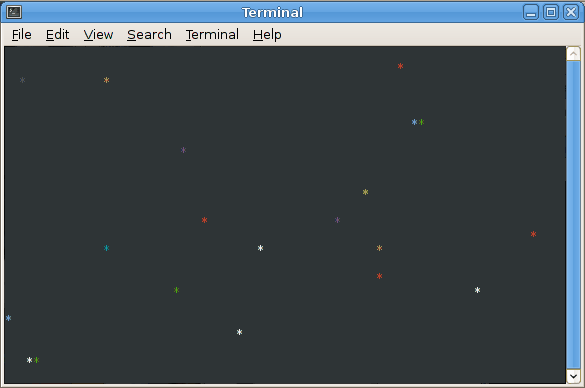
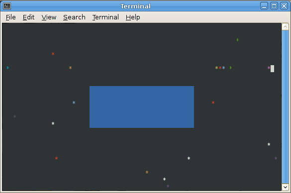

In this lab, we will turn the bouncing character animation into a simulation of multiple particles moving with arbitrary directions/velocities.

Getting Started
===============

As always, you may refer to [Lab 1](lab01.html) if you need a reminder about how to start the **Cygwin Bash Shell** or **Notepad++**.

Begin by downloading [CS101\_Lab24.zip](CS101_Lab24.zip). Save the zip file in the **H:\\CS101** directory.

Start the **Cygwin Bash Shell** and run the following commands:

    cd h:
    cd CS101
    unzip CS101_Lab24.zip
    cd CS101_Lab24

Start the **Notepad++** text editor. Use it to open the files

> **H:\\CS101\\CS101\_Lab24\\Boing4.cpp**

When you are ready to compile the program, in the Cygwin window type the command

    make

To run the program, in the Cygwin window type the command

    ./Boing4.exe

Your Task
=========

The task is similar to [Lab 18](lab18.html), [Lab 20](lab20.html), and [Lab 22](lab22.html), in which you implemented a bouncing character animation.

In this lab you will implement an animation of an arbitrary number of bouncing characters, which we will call *particles*. The particles can have arbitrary positions and directions/velocities. You will use floating-point values to represent positions and velocities, allowing more realistic motion.

The lab has two parts. Make sure that you at least finish the first part. Do the second part if you have time. (It's pretty awesome.)

Part 1
------

The goal of the first part is to simulate multiple particles:

> 

[Note that the above animation repeats after 60 seconds.]

Each particle is represented by an instance of the **struct Particle** type. The **struct Scene** data type should declare a field which is an array of **struct Particle** elements. The array should have **NUM\_PARTICLES** elements.

### Approach

Start by implementing two functions for the **struct Point** data type:

**void point\_init(struct Point \*p, double x, double y)**  
Initialize the **Point** pointed-to by the parameter **p** so that its **x** and **y** fields are set to the values in the parameters **x** and **y**.

**void point\_move(struct Point \*p, double dx, double dy)**  
Change the **x** and **y** fields of the **Point** pointed-to by the parameter **p** by adding the values of **dx** and **dy**, respectively.

Next, add fields to the **struct Particle** type. It should have:

-   a **struct Point** field to represent the position of the particle
-   **double** fields to represent the horizontal and vertical components of the particle's velocity (i.e., **dx** and **dy**)
-   an **int** field to represent the color of the particle

Implement the following functions forthe **struct Particle** data type:

**void particle\_init(struct Particle \*p)**  
Initialize the **Particle** pointed-to by the parameter **p** by setting a random position. The x coordinate should be in the range 0 .. 80, and the y coordinate should be in the range 0 .. 23. Note that these values should be floating point. For example, you can generate a **double** value between 0 and 80 using the following code: **(rand() % 8000) / 100.0**. The horizontal and vertical components of the particle's velocity should be assigned a random value in the range -1.5 .. 1.5. The expression **((rand() % 300) / 100.0) - 1.5** generates a **double** value in this range. The color should be an integer in the range 1 .. 15.

**void particle\_render(const struct Particle \*p)**  
Draw a character at the appropriate position and with the correct color for the given particle. Note that you will need to cast the particle's x and y coordinate values to **int** values when calling the **cons\_move\_cursor** function.

**void particle\_update(struct Particle \*p)**  
Update the particle's position by adding the horizontal and vertical components of the particle's velocity to its x and y coordinates. If the particle would move off of the screen, change its velocity to deflect it back into the boundaries of the screen. Suggested approach: create a **struct Point** containing the *next* position of the particle. If the next position is out of bounds, change the dx and/or dy values appropriately.

Add a single field to **struct Scene**: an array of **struct Particle** elements. The length of the array should be **NUM\_PARTICLES**.

Implement the following methods for the **struct Scene** data type:

**void scene\_init(struct Scene \*s)**  
Call the **particle\_init** function on each particle using a loop.

**void scene\_render(const struct Scene \*s)**  
Call the **particle\_render** function on each particle using a loop.

**void scene\_update(struct Scene \*s)**  
Call the **particle\_update** function on each particle using a loop.

Finally, add calls to **scene\_init**, **scene\_render**, and **scene\_update** to the **main** function.

If everything is working correctly, you should see an animation like the one shown above.

Part 2
------

The goal of part 2 is to add a rectangular obstacle to the scene:

> 

[Animation repeats after 60 seconds.]

The particles should bounce off the obstacle, so your collision detection code will need to check for this possibility.

### Approach

Start by adding fields to the **Rect** struct type. There should be two fields of type **struct Point**: the first has the minimum x/y coordinate values, and the second has the maximum x/y coordinate values.

Next, implement the following functions for the **struct Rect** data type:

**void rect\_init(struct Rect \*r, struct Point p1, struct Point p2)**  
Initialize a **struct Rect** by initializing its points to the ones given by the parameters **p1** and **p2**.

**bool rect\_contains\_point(const struct Rect \*r, struct Point p)**  
Return true if the given point is inside the given rectangle.

Next, add a **struct Rect** field to **struct Scene**. Initialize this field in **scene\_init** so that it is in the middle of the screen. Note that you will need to make sure that none of the particles is initially inside the rectangle: use a loop to repeatedly call **particle\_init** until the particle is not inside the rectangle.

Next, modify the **particle\_update** function so that it takes a pointer to a **struct Rect** as a second parameter. In the collision detection code, check whether the next x/y position of the particle would be inside the rectangle. If so, deflect it appropriately. This can be done as follows:

-   compute updated particle positions using horizontal deflection, vertical deflection, and both horizontal and vertical deflection
-   if the horizontally deflected next position is not inside the rectangle, then only horizontal deflection is needed
-   if the vertically deflected position is not inside the rectangle, then only vertical deflection is needed
-   otherwise, both horizontal and vertical deflection are needed

Finally, modify **scene\_render** so that it draws a solid rectangle representing the rectangular obstacle.

Note that in the animation above, I also added code that changes the obstacle's color from blue to green when it is struck by a particle.

Submitting
==========

When you are done, run the following command from the Cygwin bash shell:

    make submit

You will be prompted for your Marmoset username and password, which you should have received by email. Note that your password will not appear on the screen.

**Important**:

> You **must** submit your work before leaving class. If you do not submit work, you will not receive any credit for the lab.
