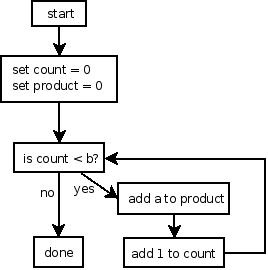

Loops
=====

All interesting algorithms involve repetition. Therefore, understanding loops is essential to being able to write interesting programs.

A single execution of the statements inside a loop is called an iteration. "Iteration" is simply a synonym for "repetition".

There are three important characteristics to any loop:

1.  **Initialization**: What must be true before the loop begins
2.  **Progress**: How the loops updates variables in order to advance from one iteration of the loop to the next
3.  **Loop condition**: What condition (boolean expression) controls whether the loop continues or terminates

If your program gets each of these characteristics right, you will have a loop that correctly carries out its intended purpose. Get them wrong and you have a buggy program.

Example: multiplying two non-negative integers
----------------------------------------------

Here is an algorithm to multiply two non-negative integers based on repeated addition:

> 

This algorithm uses a loop to add the value of the input variable **a** as many times as specified by the value of input variable **b**, storing the accumulated product in a variable called **product**. We use a variable called **count** to keep track of how many times we have added **a** to the product so far.

Let's examine the three loop characteristics for this particular loop:

1.  **Initialization**: Before the loop begins, **count** must be 0 and **product** must be 0.
2.  **Progress**: In each iteration of the loop, we add **a** to product and add 1 to **count**.
3.  **Loop condition**: The loop continues as long as **count** is less than **b**. When **count** is greater than or equal to **b**, the loop terminates.

Loop variables
--------------

Critical to the correctness of both loops is the existence and correct handling of the loop variable. A loop variable is a variable that is used and/or updated on each iteration of the loop. At least one loop variable must be used in the loop condition.

Question: which variable or variables in the multiplication algorithm are the loop variables?

One critical property to ensure is that the loop will terminate in a finite number of steps. A loop that does not terminate is an infinite loop. Infinite loops are a very common kind of bug; when the program tries to execute an infinite loop, the loop will never terminate, and the program will appear to freeze.

To ensure that your loops terminate, you should make sure that once your loop's initialization has been executed, the progress that is accomplished on each iteration of the loop eventually causes the loop condition to become false, allowing the loop to terminate.

The for loop
------------

C supports three kinds of loops. The most general is the for loop.

General syntax:

<pre>
for ( <i>initialization</i> ; <i>condition</i> ; <i>update</i> ) {
    <i>statements</i>
}
</pre>

The *initialization* of the for loop sets the values of one or more variables. Generally, it sets the initial value of the loop variable.

The *condition* of the for loop is the loop condition. It is a boolean expression that determines, at the beginning of each iteration, whether the iteration should proceed or if the loop should terminate. The condition must test the value of the loop variable!

The *statements* are a sequence of statements that are executed on each iteration of the loop. The statements make up the *body* of the loop.

The *update* updates the values of one or more variables. It is generally used to update the value of the loop variable. It is executed once for each iteration of the loop, after the statements in the loop body are executed.

Here's how we might implement our multiplication algorithm using a for loop. Each stage of the algorithm is translated into one of the components of the for loop.


int a, b, product, count;

printf("Enter two non-negative numbers: ");
scanf("%i %i", &a, &b);

for (product = 0, count = 0; count < b; count = count + 1) {
    product = product + a;
}

printf("The product of %i and %i is %i\n", a, b, product);


Loops can execute 0 iterations
------------------------------

Consider the loop for the "multiplication by repeated addition" algorithm. What happens if **b** = 0?

Answer: the loop condition is checked before every iteration of the loop, including the first iteration. If **b** = 0, then the loop condition **count \< b** is immediately false. Therefore, no iterations of the loop execute and the loop terminates immediately. In this case, this is the correct behavior: 0 times anything is 0.

Loop Recipes
============

When you need to write a loop, sometimes it's not obvious to know how to get started.

Fortunately, many loops are based on a standard "recipe". If you know the recipes, you can start with a basic version of the loop, and then customize it to meet your needs.

Often, all you will need to know is the number of times the body of the loop should execute. We will call this **n** in the recipes below.

Count up from 1 to n
--------------------


for (int i = 1; i <= n; i++) {
    ...
}


Recall that **i++** is a statement that increases the value of the variable **i** by 1.

Count up from 0 to n-1
----------------------

Sometimes it is better to count starting at 0 rather than 1. In this case, if the loop body executes **n** times, in the last execution of the loop body the loop variable **i** will be **n**-1.


for (int i = 0; i < n; i++) {
    ...
}


Counting down from n to 1
-------------------------

Sometimes you need to count down rather than counting up.


for (int i = n; i >= 1; i--) {
    ...
}


Recall that **i--** is a statement which decreases the value stored in the variable **i** by 1.

Counting down from n-1 to 0
---------------------------

You might need to count down to 0 rather than 1. Note that if you want the body of the loop to execute exactly **n** times, then you must start at **n**-1.


for (int i = n-1; i >= 0; i--) {
    ...
}


Count from a min to max
-----------------------

Counting from an arbitrary **min** value up to an arbitrary **max** value.


for (int i = min; i <= max; i++) {
    ...
}


Count from 1 to n by increments
-------------------------------

Sometimes you may need to skip every **k** values. For example, say we want to generate all of the odd integers from 1 to **max**.


for (int i = 1; i <= max; i += 2) {
    ...
}


Note that **i += 2** is a statement which increases the value of the variable **i** by 2.

Computing a sum of n terms
--------------------------

Loops that compute a sum of **n** terms will need to use an *accumulator variable* to build up the sum. Each execution of the loop body will increase the accumulator by adding one term to it.

You can start with any of the loop recipes described above.

It is critical that the accumulator variable is initialized to an appropriate value, usually 0, before the loop starts.


double sum = 0.0; // the accumulator
for (int i = 1; i <= n; i++) {
    double term = ...;

    sum += term;
}


Note that **sum += term** is a statement which adds **term** to **sum**, and stores the result back in **sum**. So, **sum** increases by an amount equal to **term**.

Customizing a loop
==================

Once you have chosen a loop recipe, you can customize it to perform the exact task required.

Example: say we want to compute the sum of the first **n** terms of the series

> 1/1 - 1/3 + 1/5 - 1/7 + 1/9 - 1/11 + 1/13 + ...

We can see two important requirements:

-   the loop needs to execute **n** times
-   the loop needs to compute a sum of terms

So, let's use the **count from 1 to n** and **computing a sum of n terms** recipes. Here's out basic starting point:


double sum = 0.0; // the accumulator
for (int i = 1; i <= n; i++) {
    double term = ...;

    sum += term;
}


The only information that is missing is the value of the term. How can we figure out how to compute the term?

Plan the iterations of the loop
-------------------------------

An excellent strategy is to simply write down what happens on each iteration of the loop. ("Iteration" means one execution of the loop body.)

Start with what you know: the value of **i**, the loop counter variable. Let's say that **n**, the number of terms to compute, is 5. Here are the values of **i** for each of the 5 iterations of the loop:

> <table>
> <col  />
> <thead>
> <tr class="header">
> <th align="left">i</th>
> </tr>
> </thead>
> <tbody>
> <tr class="odd">
> <td align="left">1</td>
> </tr>
> <tr class="even">
> <td align="left">2</td>
> </tr>
> <tr class="odd">
> <td align="left">3</td>
> </tr>
> <tr class="even">
> <td align="left">4</td>
> </tr>
> <tr class="odd">
> <td align="left">5</td>
> </tr>
> </tbody>
> </table>

We can observe that each term is 1/**denom**, which **denom** is 1, 3, 5, 7, etc. So, if we could compute the value of **denom**, we would be closer to computing **term**. What we want, then, is

> i   | denom
> --- | -----
> 1   | 1
> 2   | 3
> 3   | 5
> 4   | 7
> 5   | 9

How do we get **denom**? We can *derive* it from **i**, our counter variable. First, observe that **denom** is increasing by 2 on each iteration. So, its value is about twice that of **i**. Let's see how **denom** might be related to **i**\*2:

> i   | denom | i*2
> --- | ----- | ---
> 1   | 1     | 2
> 2   | 3     | 4
> 3   | 5     | 6
> 4   | 7     | 8
> 5   | 9     | 10

Now we can see that **i**\*2 is always exactly one greater than **denom**. So, if we subtract 1, we get a value equal to our desired **denom** value:

> i   | denom | i*2 | (i*2) - 1
> --- | ----- | --- | ---------
> 1   | 1     | 2   | 1
> 2   | 3     | 4   | 3
> 3   | 5     | 6   | 5
> 4   | 7     | 8   | 7
> 5   | 9     | 10  | 9

Now, all that's left to consider is that each term has a sign that is positive or negative, and that the signs alternate with each term. Looking more closely, we see that when **i** is odd, the sign is positive, and when **i** is even, the sign is negative:

> i   | denom | i*2 | (i*2) - 1 | sign
> --- | ----- | --- | --------- | ----
> 1   | 1     | 2   | 1         | +
> 2   | 3     | 4   | 3         | -
> 3   | 5     | 6   | 5         | +
> 4   | 7     | 8   | 7         | -
> 5   | 9     | 10  | 9         | +

We can handle this by adding an **if**/**else** statement to the loop. For odd values of **i**, we'll make the term positive, and for even values of **i**, we'll make the term negative.

Now that we have planned the behavior of the loop, it is easy to customize our initial version of the loop to compute the correct values for each term:


double sum = 0.0; // the accumulator
for (int i = 1; i <= n; i++) {
    double denom = (i * 2) - 1;

    double term;
    if (i % 2 == 1) {
        // odd, so positive
        term = 1.0 / denom;
    } else {
        // even, so negative
        term = -(1.0 / denom);
    }

    sum += term;
}


If you plan your loops this way, it is generally straighforward to take one of the basic loop recipes and customize it to meet your program's needs.
