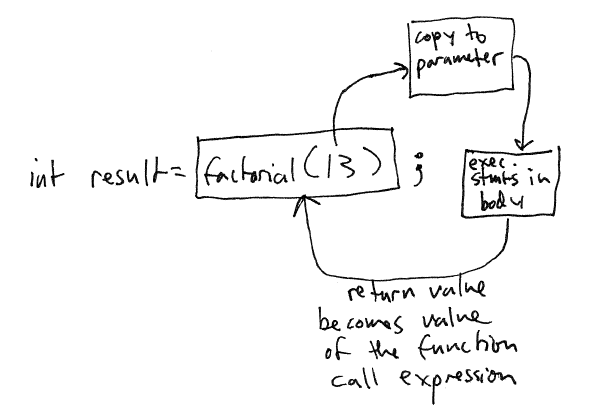

Functions that Return a Value
=============================

So far we have looked at functions that do not compute a value. We declare these to have the **void** return type.

In many cases, we WILL want to define functions that can be used to compute values. By declaring a function as having a return type other than **void**, we are declaring it as computing that kind of value if it is used in an expression.

Examples:

<table>
<thead>
<tr class="header">
<th align="left"><strong>Function name</strong></th>
<th align="left"><strong>Information needed</strong></th>
<th align="left"><strong>Parameters</strong></th>
<th align="left"><strong>Result computed</strong></th>
<th align="left"><strong>Return type</strong></th>
</tr>
</thead>
<tbody>
<tr class="odd">
<td align="left">sumRange</td>
<td align="left">min and max values of range</td>
<td align="left">int min, int max</td>
<td align="left">sum of integers in range</td>
<td align="left"><strong>int</strong></td>
</tr>
<tr class="even">
<td align="left">factorial</td>
<td align="left">value to compute factorial of</td>
<td align="left">int value</td>
<td align="left">factorial of value</td>
<td align="left"><strong>int</strong></td>
</tr>
<tr class="odd">
<td align="left">isOdd</td>
<td align="left">an integer value to test</td>
<td align="left">int value</td>
<td align="left">whether or not the value is odd</td>
<td align="left"><strong>int</strong> (really boolean)</td>
</tr>
<tr class="even">
<td align="left">sqrt</td>
<td align="left">a double value</td>
<td align="left">double value</td>
<td align="left">square root of value</td>
<td align="left"><strong>double</strong></td>
</tr>
</tbody>
</table>

Function calls
==============

Compute the factorial of 13:


int result;
result = factorial(13);
printf("factorial of 13 is %i\n", result);


What is happening?

> 

Compute the sum of a range of integer values entered by the user:


int min, max, sum;
scanf("%i %i", &min, &max);
sum = sumRange(min, max);
printf("sum is %i\n", sum);


If the user's age is odd, print a message:


int age;
scanf("%i", &age);

if (isOdd(age)) {
    printf("your age is odd\n");
}


Implementing Functions that Return a Value
==========================================

**Return statements**

In functions that compute a value, a **return** statement is used to specify the result of performing the computation. As soon as a **return** statement is reached, the indicated value is returned, and used as the value of the function call expression at the call site.

Examples:

**sumRange** function:


int sumRange(int min, int max) {
    int sum = 0;
    for (int i = min; i <= max; i++) {
        sum += i;
    }

    return sum;
}


**isOdd** function:


int isOdd(int value) {
    if ((value % 2) == 1) {
        return 1;
    } 
    else {
        return 0;
    }
}


**Important**: It is critical that when you write a function that returns a value, it is guaranteed to return a value. For example, consider a buggy version of **isOdd**:


int isOdd(int value) {
    if ((value % 2) == 1) {
        return 1;
    }
}


This version of **isOdd** does not return a value if the parameter is even. When the program runs, if an even value is passed to the function, the value returned by the function will be unpredictable, and strange behavior may result.

Testing
=======

It is very important to *test* your functions to make sure they work correctly.

One way to test is to use some logic with **printf**'s to check that functions are returning the expected value for particular input. Note: be careful when checking floating point numbers for *equality* as roundoff errors can occur. For example, to test the factorial function


#include <stdio.h>

int factorial(int value);

int main(void) {

    if (6 == factorial(3)) {
        printf("Test passed 6 = %i\n",factorial(3));
    } else {
        printf("Test failed\n 6 != %i\n",factorial(3));
    }

    return 0;
}

int factorial(int value) {
    ...
}

