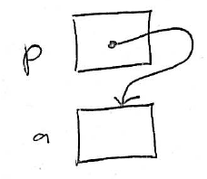
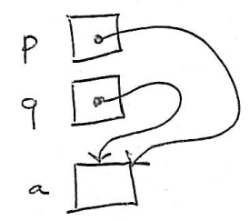

Pointers and addresses
======================

Recall that a variable is a storage location where a value can be stored.

Each variable has an *address* naming its storage location. Different variables will have different addresses, because each variable uses a different storage location.

Addresses are really just integers. For example, consider the following code:


int a;

a = 6;


Let's say that when the program runs, the variable **a** has the address **1000000**. When the compiler generates machine instructions for the statement assigning the value 6 to **a**, the instruction will have the form

> store the value **6** in the memory location at address 1000000

So, at a low level, the computer deals with all storage locations in terms of addresses. Variable names are simply a convenience for the human being writing the program using a high-level language like C/C++.

C and C++ provide a mechanism, called *pointers*, to allow you to write programs that explicitly use addresses to refer to variables. Pointers are a useful feature because if you know the address of a variable, you can access the variable (loading a value from it or storing a value into it.)

Pointer variables
-----------------

A *pointer variable* is a variable in which the the program will store the address of another variable. Pointer variables are declared by putting an asterisk ("\*") in front of the name of the variable.

Example:


int *p;


This declaration defines a variable called **p** in which we may store the address of a variable whose type is **int**. We read this declaration as

> **p** is a pointer-to-int

The right way to think about pointer variables is that they give us an *indirect* way of referring to other variables in the program.

**Analogy**:

> Say that you want to send me a letter. You can accomplish this in two ways.
>
> You could go to my mailbox, and put the letter in the mailbox. This is like storing a value (letter) in a variable (mailbox) by using the name of the variable explicitly: you are *directly* accessing the variable.
>
> If you know my **address** --- which describes where my mailbox is *located* --- then you can have the postal service deliver the letter to that address. This works because the address describes the *location* of my mailbox. This is like storing a value (letter) in a variable (mailbox) *indirectly* by using the variable's address.

Address-of operator
-------------------

A variable isn't very useful unless we can store a value in it. Since pointer variables store addresses, we need a way of finding the address of a variable. This is done with the *address-of operator*, which is the ampersand ("&").

Example:


int *p;
int a;

p = &a; // store the address of a in p


Following the assignment of **a**'s address to **p**, we say that

> **p** *points to* **a**

It is very useful to visualize points-to relationships by drawing diagrams. Each variable is represented by a box labeled with the variable's name. The value of the variable goes inside the box. For pointer variables, we represent the value as an arrow starting in the box and ending at the variable that the pointer points to. For example, the diagram

> 

indicates that the variable **p** points to the variable **a**, meaning that **p** contains **a**'s address.

Dereference operator
--------------------

In the examples above, the variable **p** is a pointer to int, meaning that it stores the address of an int variable. You can refer to the variable that **p** points to using the *dereference* operator, the asterisk ("\*").

Using the dereference operator is very simple. If **p** is a pointer to an int variable, then

    p

is the address of the variable that **p** points to, and

    *p

**is** the variable that **p** points to.

Example:


int *p;
int a;

p = &a; // store address of a in p

a = 42;
printf("%i\n", *p); // prints 42


Because **p** contained the address of **a** at the time of the **printf** statement, and because **a** contained the value 42, printing **p** resulted in the output **42** being printed.

We can also *modify* the value of a variable if we have a pointer to it:


int *p;
int a;

p = &a;

*p = 17;

printf("%i\n", a); // prints 17


Even though there is no direct assignment of a value to **a**, the assignment to **\*p** serves as an *indirect* assignment to **a**, since **p** points to **a**.

Assignment of pointer values
============================

Pointer values are values just like any other kind of value. So, if we use an assignment to copy the value of one pointer variable into another, the result is that both pointers variables end up pointing to the same location/variable.

Example:


int *p;
int *q;
int a;

p = &a; // make p point to a
q = p;  // make q point to the same variable as p
// (*) see diagram below

a = 121;
printf("%i\n", *q); // prints 121


Here is a diagram showing the points-to relationships just after the assignment **q = p**:

> 

Reference parameters
====================

You're probably saying to yourself,

> *Sure, this is very interesting and all, but what are pointers actually useful for?*

One important use of pointers is to implement *reference parameters*. A reference parameter is a parameter to a function that is able to modify a variable whose address (pointer) is passed as a parameters. One common use of reference parameters is to allow a function to "return" multiple values.

For example, as we saw in [Lab 12](../labs/lab12.html), a arbitrary color can be represented red, green, and blue color component values in the range 0..255. To compute a random color, we can generate three random integers in this range. Because a function can only directly return a single value, we can't declare the function to return all three values directly. However, we *can* declare the function to take three parameters, each of which is a pointer to **int**. The parameters will point to the variables in which the three random integers should be stored.

Here is an example program to demonstrate this idea:


#include <stdio.h>
#include <stdlib.h>
#include <time.h>

void make_rand_color(int *rp, int *gp, int *bp);

int main(void) {
    srand(time(0));
    int r, g, b;
    make_rand_color(&r, &g, &b);
    printf("Your color is #%2x%2x%2x\n", r, g, b);
    return 0;
}

void make_rand_color(int *rp, int *gp, int *bp) {
    *rp = rand() % 256;
    *gp = rand() % 256;
    *bp = rand() % 256;
}


In the **main** function, we pass the addresses of the variables **r**, **g**, and **b** to the **make\_rand\_color** function, which receives them as the parameters **rp**, **gp**, and **bp**. The **make\_rand\_color** function then assigns random values to the variables pointed to by its parameters.

Note that the **%x** conversion prints an integer value using hexidecimal, which is a base 16 representation where the digits a-f represent the values 10 through 15.

A sample run of this program produced the output

    Your color is #8b51af

In case you're curious, this color is:

> 

