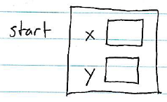
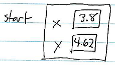

*Struct types* allow us to define new data types in our programs. We can use functions to define *operations* on struct types, leading to an extremely powerful programming technique called *encapsulation*.

Motivation for defining new data types
======================================

Let's say we're writing a program that is going to work with two-dimensional geometrical data. One important kind of data the program will manipulate is *points*. A point is two values:

1.  an x-coordinate
2.  a y-coordinate

One way to represent a point is as two variables. For example, let's say that we have a point representing a starting location. We could define variables to represent the point as follows:


double startX;
double startY;


This point representation works, but it's awkward. Each point represented in our program is represented by two variables. Let's say we extend the program to work with three-dimensional data. Now we need **three** variables for each point, e.g.:


double startX;
double startY;
double startZ;


Another way in which we can see the awkwardness of using multiple variables to represent a point is when we write functions to perform operations on points. For example, we might want to write a function to compute the geometric distance between two points. For two-dimensional points, this function would require four parameters, two for each point:


double geometricDistance(double point1X, double point1Y, double point2X, double point2Y)
{
    double xDist = point1X - point2X;
    double yDist = point1Y - point2Y;
    return sqrt((xDist * xDist) + (yDist * yDist));
}


If we change the program to support three-dimensional data, now this function needs **six** parameters. Blech!

Struct types
============

A *struct type* defines a new data type as some number of *fields*.

For example, we could define a struct type for two-dimensional points as follows:


struct Point {
    double x;
    double y;
};


The **Point** struct type has two fields:

-   a **double** field named **x**
-   a **double** field named **y**

That means that each *instance* of the **Point** type has two values, **x** and **y**, both of which are **double**s. A definition of a struct type is a "template" that specifies what data is contained in instances (variables) of the type.

Struct instances
================

Once you have defined a struct type in a program, it can be used to declare instances of the type. E.g.:


struct Point start;


This declaration defines the variable **start** as an *instance* of the **Point** data type.

You can think of variables that have struct types as "bundles" of variables glued together. Each field defined in the struct type becomes a variable in each instance of the struct type.

It is helpful to visualize struct instances as boxes containing "nested" boxes representing fields: e.g.,

> 

Accessing fields
----------------

The field variables located within each struct instance can be accessed using the *member selection operator*, denoted by a period ("**.**").

For example, we could use the following code to initialize the **start** instance declared above, storing values in each of its fields:


// set start point to x=3.8, y=4.62
start.x = 3.8;
start.y = 4.62;


After this code executes, we can visualize the **start** instance like this:

> 

Its **x** and **y** fields have now been set to the values 3.8 and 4.62, respectively.

The member selection operator can also be used to retrieve the value of a field inside a struct instance. For example, we could print the contents of the **start** instance:


printf("start: x=%lf, y=%lf\n", start.x, start.y);


Struct types + functions = encapsulation
========================================

The real power of struct types becomes apparent when they are used in conjunction with functions. The idea is that we can write functions to perform *operations* - i.e., computations - on instances of struct types.

For example, the function to compute the geometric distance between two points could be defined as:


double geometricDistance(struct Point point1, struct Point point2)
{
    double xDist = point1.x - point2.x;
    double yDist = point1.y - point2.y;
    return sqrt((xDist * xDist) + (yDist * yDist));
}


Using struct types and functions together in this way is called *encapsulation*, because the struct type and the functions that operate on its instances "encapsulate" a concept that is important in the program. Together, the struct type and its operations (functions) make your programs more expressive and easier to understand because both data and operations on data are given meaningful names. E.g., when we see the code


struct Point start;


it is clear that **start** is a point. Likewise, when we see the code


struct Point start, end;

...

double tripDistance = geometricDistance(start, end);


it is clear that the distance between two points called **start** and **end** is being computed.

Encapsulation makes the program easier to understand and change
---------------------------------------------------------------

Let's say that we've written a program to do computations on two-dimensional points using a **Point** struct type and functions to perform operations on **Point** instances.

To update the program to work with three-dimensional points, we would need to do the following:

1.  add a **z** field to the **Point** struct type
2.  change the code of functions such as **geometricDistance** to take the additional dimension into account

Assuming that all of the code that does computations on instances of the **Point** type is written to call functions such as **geometricDistance**, instead of doing to computations directly (by accessing the fields), then

> **no additional code changes are needed**

This advantage of struct types and functions---making programs easier to change---is very significant for large and complex programs.
