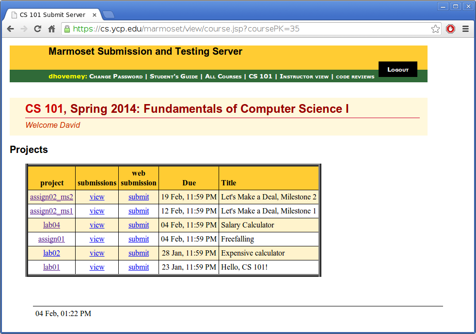
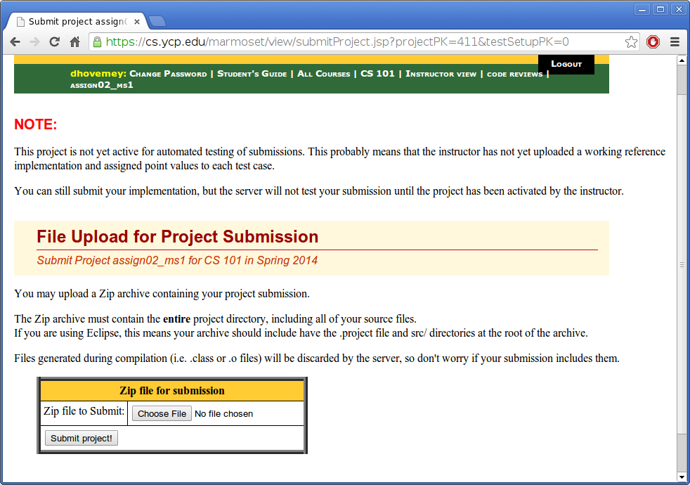

This document describes how to submit labs and assignments to Marmoset.

# Using make

All of the labs and assignments allow submission using the **make** command.  You should run this command (in Cygwin terminal) from within the lab or assignment directory.

For labs and assignments that do *not* have multiple milestones, the command will be

    make submit

For labs and assignments that *do* have multiple milestones, the command will depend on the milestone.  For example, to submit milestone 1, you would use the command

    make submit_ms1

Refer to the assignment description for specific information on how to submit milestones.

# Using the web interface

If submission using **make** is not working, you can upload your submission directly using the Marmoset web interface.

First, run the command

    make solution.zip

from the lab or assignment directory.  This will create a zipfile with all of the files to be submitted.

Next, log into Marmoset.  The URL is

> [https://cs.ycp.edu/marmoset](https://cs.ycp.edu/marmoset)

You should see a list of labs and assignments, something like the following (click for full size):

> 

Notice that each project has a **submit** link.  Click on the link for the lab or assignment you want to submit.  You should see a page something like the following:

> 

You can ignore the warning about automatic submission not being enabled.  At this point you should be able to upload the **solution.zip** file you created earlier.
